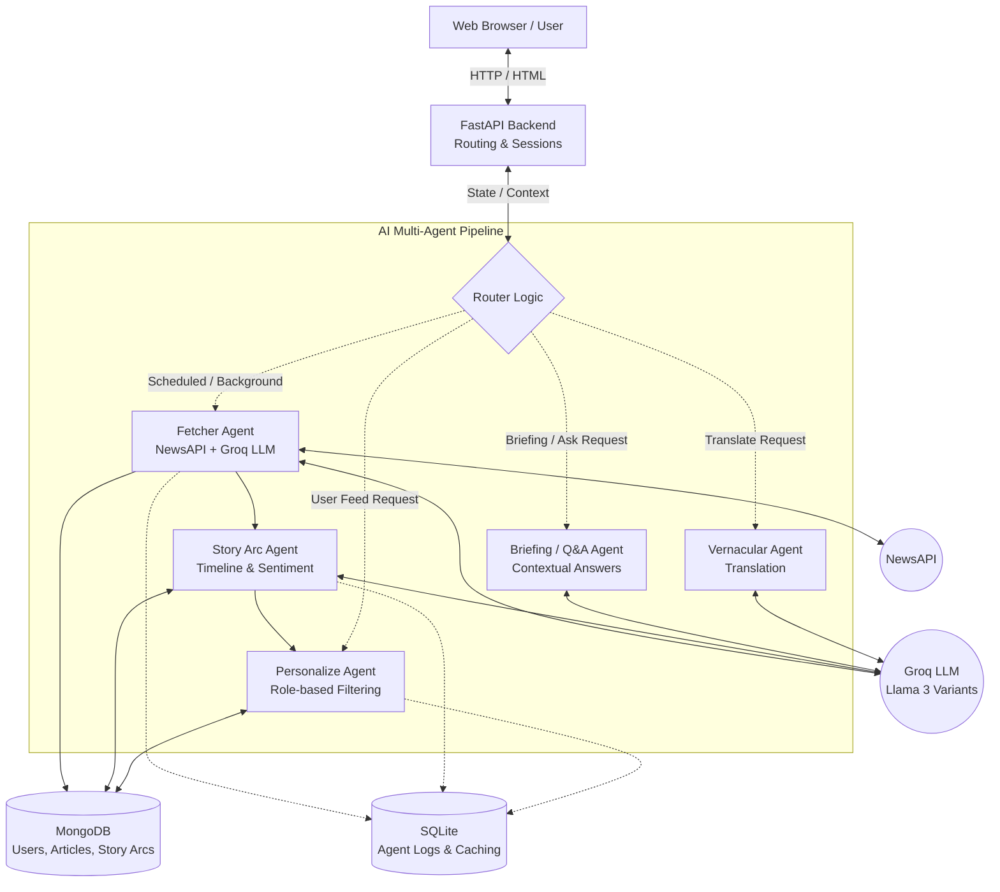

# NewsSpark Architecture Overview

NewsSpark is an AI-native business news platform that automatically fetches, classifies, and personalizes news for different types of users (e.g., students, investors, startup founders). It uses a multi-agent framework to process news dynamically.

## Architecture Diagram

## How It Works (Simply Explained)

1. **The Backend (FastAPI)**: Serves the web-pages to the user and handles user sessions (login/logout). When a user requests their news feed or asks a question, FastAPI packages this request and sends it to the central AI Pipeline.
2. **The AI Pipeline (LangGraph)**: The "brain" of the operation. It acts as a router that directs work to specialized "agents" (isolated units of code) that work together:
   * **Fetcher Agent**: Runs in the background every 30 minutes. It pulls the latest business news from the external NewsAPI, uses an AI model (Groq) to read and classify the news by category and sentiment, and saves it to the database.
   * **Story Arc Agent**: Groups related news articles into a "story arc" (a chronological timeline of events) to help users understand how a broader news topic has evolved over time.
   * **Personalize Agent**: Looks at exactly who the user is (e.g., an investor vs. a student) and filters the database to serve only the most relevant articles to their feed.
   * **Briefing & Vernacular Agents**: On-demand agents that summarize complex topics into quick briefings, answer specific user questions about the news, and translate articles into local languages instantly.
3. **The Data Storage**: 
   * **MongoDB** stores all the actual heavy content: user profiles, fetched articles, and generated story arcs.
   * **SQLite** is used locally to quickly log what the agents are doing and cache intermediate results.
4. **The Final User Experience**: A user logs in, the platform notes their role (e.g., student), and the `Personalize Agent` instantly queries MongoDB for tailored news that was already structured and ingested in the background by the `Fetcher` and `Story Arc` agents. When the user wants to read an article in Hindi, the `Vernacular Agent` dynamically translates it on the fly.
